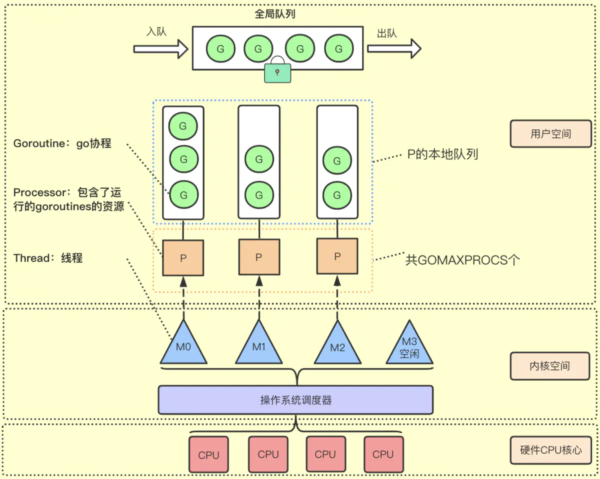
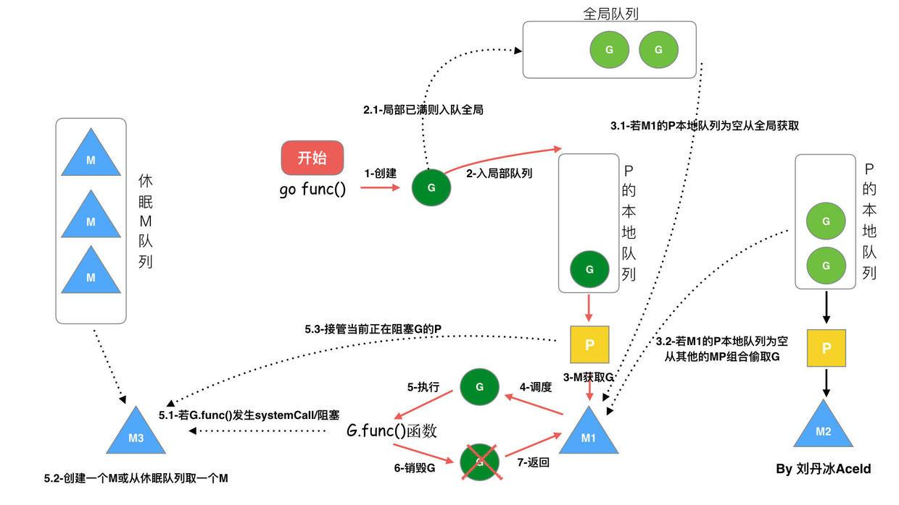

# goroutine认识

### 介绍一下`goroutine`
​	现代操作系统中，线程是处理器调度和分配的基本单位，进程作为资源拥有的基本单位，如虚拟空间、代码、数据和系统资源等。操作系统为了系统安全，将体系架构分为了用户空间和内核空间；内核空间包括，cpu资源，io资源和内存等硬件资源，用户空间必须通过系统调用，库函数等来调用内核空间。

​	线程的

`Goroutine`=golang+coroutine，拥有以下特点
1 相比线程，创建G的初始栈大小为（2Kb左右），能动态的伸缩栈大小，最大支持Gb级别。 （如果面试官问: 线程占用空间大概是2M左右（10M的虚拟内存），你继续答： 你申请一块内存，操作系统不是马上给你一块实际内存，而只是给你一个逻辑地址，当你真的访问这段地址时，操作系统才会进行逻辑地址到物理地址的映射。所以才会有物理内存和虚拟内存两个概念，如果一样的话，也就没有区分的必要了。）
2 工作在用户态，切换成本很小
3 与线程关系是n:m，即可以在n个系统线程上多工调度m个Goroutine(存在内核级线程、用户级线程(spp)、两级线程模型)

### 介绍GMP模型

当前 goroutine 绑定运行的`P`的 id。每个goroutine创建后会挂在`P`结构体上；运行时，需要绑定`P`才能在`M`上执行

- G(Goroutine): go协程，一个可执行单元，调度器作用就是对所有G的切换	

- M(Thread)：操作系统上的线程，G运行与M上，一个G可能由多个不同的M运行，一个M可以运行多个G。M最多可以创建 10000 个线程

- P(Processor)：处理器，他包含了运行G的资源，如果线程M想运行G，必须先获取P，P还包含了可运行的G`队列`。一个M一个时刻只拥有一个P，M和P的数量是1：1的。最多有GOMAXPROCS个，可通过runtime.GOMAXPROCS(N)修改，N表示设置的个数。P可以被看做运行在线程上的本地调度器；

  

上图中各个模块的作用如下：

1. 全局队列：存放等待运行G

2. P的本地队列：和全局队列类似，存放的也是等待运行的G，存放数量上限256个。新建G时，G优先加入到P的本地队列，如果队列满了，则会把本地队列中的一半G移动到全局队列

3. P列表：所有的P都在程序启动时创建，保存在数组中，最多有GOMAXPROCS个，可通过runtime.GOMAXPROCS(N)修改，N表示设置的个数

4. M是Goroutine调度器和操作系统调度器的桥梁，每个M代表一个内核线程，操作系统调度器负责把内核线程分配到CPU的核心上执行。

提问：**1.0之前GM调度模型存在的问题 或者 没有P可不可以等** 
调度器把G都分配到M上，不同的G在不同的M并发运行时，都需要向系统申请资源，比如堆栈内存等，因为资源是全局的，就会因为资源竞争照成很多性能损耗。为了解决这一的问题go从1.1版本引入，在运行时系统的时候加入p对象，让P去管理这个G对象，M想要运行G，必须绑定P，才能运行P所管理的G。

   1 单一全局互斥锁(Sched.Lock)和集中状态存储
   2 Goroutine 传递问题（M 经常在 M 之间传递”可运行”的 goroutine）
   3 每个M做内存缓存，导致内存占用过高，数据局部性较差
   4 频繁syscall调用，导致严重的线程阻塞/解锁，加剧额外的性能损耗

### GMP调度流程

- 每个P有个局部队列，局部队列保存待执行的goroutine(流程2)，当M绑定的P的的局部队列已经满了之后就会把goroutine放到全局队列(流程2-1)

- 每个P和一个M绑定，M是真正的执行P中goroutine的实体(流程3)，M从绑定的P中的局部队列获取G来执行

- 当M绑定的P的局部队列为空时，M会从全局队列获取到本地队列来执行G(流程3.1)，当从全局队列中没有获取到可执行的G时候，M会从其他P的局部队列中偷取G来执行(流程3.2)，这种从其他P偷的方式称为work stealing

- 当G因系统调用(syscall)阻塞时会阻塞M，此时P会和M解绑即hand off，并寻找新的idle的M，若没有idle的M就会新建一个M(流程5.1)。

- 当G因channel或者network I/O阻塞时，不会阻塞M，M会寻找其他runnable的G；当阻塞的G恢复后会重新进入runnable进入P队列等待执行(流程5.3)

#### 复用线程

- work stealing机制（窃取式）
答：当本线程无G可运行时，尝试从其他线程绑定的P窃取G，而不是直接销毁线程。
细节：存到P本地队列或者是全局队列。P此时去唤醒一个M。P继续执行它的执行序。M寻找是否有空闲的P，如果有则将该G对象移动到它本身。接下来M执行一个调度循环(调用G对象->执行->清理线程→继续找新的Goroutine执行)

如果有问顺序，当从绑定 P 本地runq上找不到可执行的goroutine后，尝试从全局链表中拿，再拿不到从 netpoll 和事件池里拿，最后会从别的 P 里偷任务。

- hand off机制
简单回答：当本线程M因为G进行的系统调用阻塞时，线程释放绑定的P，把P转移给其他空闲的M'执行。

细节：会发生上下文切换。当发生上线文切换时，需要对执行现场进行保护，以便下次被调度执行时进行现场恢复。Go调度器M的栈保存在G对象上，只需要将M所需要的寄存器(SP、PC等)保存到G对象上就可以实现现场保护。当这些寄存器数据被保护起来，就随时可以做上下文切换了，在中断之前把现场保存起来。如果此时G任务还没有执行完，M可以将任务重新丢到P的任务队列，等待下一次被调度执行。当再次被调度执行时，M通过访问G的vdsoSP、vdsoPC寄存器进行现场恢复(从上次中断位置继续执行)。

### 抢占式调度器
#### 协作式的抢占式调度

在1.14版本之前，程序只能依靠 Goroutine 主动让出 CPU 资源才能触发调度，存在问题
1. 某些 Goroutine 可以长时间占用线程，造成其它 Goroutine 的饥饿
2. 垃圾回收需要暂停整个程序（Stop-the-world，STW），最长可能需要几分钟的时间，导致整个程序无法工作

#### 基于信号的抢占式调度

src/runtime/proc.go/sysmon() 
sysmon，它是一个系统级的 daemon 线程。这个sysmon 独立于 GPM 之外，也就是说不需要P就可以运行，也是作为抢占信号的发送方一直运行。
细节：
在任何情况下，Go运行时并行执行（注意，不是并发）的 goroutines 数量是小于等于 P 的数量的。为了提高系统的性能，P 的数量肯定不是越小越好，所以官方默认值就是 CPU 的核心数，设置的过小的话，如果一个持有 P 的 M，由于 P 当前执行的 G 调用了 syscall 而导致 M 被阻塞，那么此时关键点：GO 的调度器是迟钝的，它很可能什么都没做，直到 M 阻塞了相当长时间以后，才会发现有一个 P/M 被 syscall 阻塞了。然后，才会用空闲的 M 来强这个 P。通过 sysmon 监控实现的抢占式调度，最快在20us，最慢在10-20ms才会发现有一个 M 持有 P 并阻塞了。操作系统在 1ms 内可以完成很多次线程调度（一般情况1ms可以完成几十次线程调度），Go 发起 IO/syscall 的时候执行该 G 的 M 会阻塞然后被OS调度走，P什么也不干，sysmon 最慢要10-20ms才能发现这个阻塞，说不定那时候阻塞已经结束了，宝贵的P资源就这么被阻塞的M浪费了。
补充说明：调度器迟钝不是 M 迟钝，M 也就是操作系统线程，是非常的敏感的，只要阻塞就会被操作系统调度（除了极少数自旋的情况）。但是 GO 的调度器会等待一个时间间隔才会行动，这也是为了减少调度器干预的次数。也就是说，如果一个 M 调用了什么 API 导致了操作系统线程阻塞了，操作系统立刻会把这个线程M调度走，挂起等阻塞解除。这时候，Go 调度器不会马上把这个 M 持有的 P 抢走。这就会导致一定的 P 被浪费了。

#### 调度过程中阻塞

- I/O，select
- block on syscall
- channel
- 等待锁
- runtime.Gosched()

**用户态阻塞**
当goroutine因为channel操作或者network I/O而阻塞时（实际上golang已经用netpoller实现了goroutine网络I/O阻塞不会导致M被阻塞，仅阻塞G），对应的G会被放置到某个wait队列(如channel的waitq)，该G的状态由_Gruning变为_Gwaitting，而M会跳过该G尝试获取并执行下一个G，如果此时没有runnable的G供M运行，那么M将解绑P，并进入sleep状态；当阻塞的G被另一端的G2唤醒时（比如channel的可读/写通知），G被标记为runnable，尝试加入G2所在P的runnext，然后再是P的Local队列和Global队列。

**系统调用阻塞**
当G被阻塞在某个系统调用上时，此时G会阻塞在_Gsyscall状态，M也处于 block on syscall 状态，此时的M可被抢占调度：执行该G的M会与P解绑，而P则尝试与其它idle的M绑定，继续执行其它G。如果没有其它idle的M，但P的Local队列中仍然有G需要执行，则创建一个新的M；当系统调用完成后，G会重新尝试获取一个idle的P进入它的Local队列恢复执行，如果没有idle的P，G会被标记为runnable加入到Global队列。

### sysmon

sysmon 也叫监控线程，变动的周期性检查，好处
- 释放闲置超过5分钟的 span 物理内存；
- 如果超过2分钟没有垃圾回收，强制执行；
- 将长时间未处理的 netpoll 添加到全局队列；
- 向长时间运行的 G 任务发出抢占调度(超过10ms的g，会进行retake)；
- 收回因 syscall 长时间阻塞的 P；

### GM存在的问题

- 单一全局互斥锁(Sched.Lock)和集中状态存储的存在导致所有goroutine相关操作，比如：创建、重新调度等都要上锁；
- goroutine传递问题：M经常在M之间传递『可运行』的goroutine，这导致调度延迟增大以及额外的性能损耗；
- 每个M做内存缓存，导致内存占用过高，数据局部性较差；
- 由于syscall调用而形成的剧烈的worker thread阻塞和解除阻塞，导致额外的性能损耗。

#### 问题扩展

- 项目中使用go遇到的坑
- 项目中是否碰到go泄漏
  1. goroutine本身的栈所占用的空间造成内存泄露。
  2. goroutine中的变量所占用的堆内存导致堆内存泄露，这一部分是能通过heap profile体现出来的
  3. 是否会有阻塞造成无法退出，channel等待等
     - 解决方法手段 go pprof获取goroutine profile文件，然后利用3个命令top、traces、list定位内存泄露的原因
- 两个(或多个)协程交替打印1-100(数据)
- 实现超时机制，当设置的超时时间到达后如果work还不可执行就终止等待，返回超时
- 实现一个惰性迭代器，每次调用返回一个列表元素，直到所有的元素被访问完返回nil
- [代码参考](./code.md)

## References

[Go语言调度模型G、M、P的数量多少合适](https://www.jianshu.com/p/1a50330adf1b)

[单核CPU下Go语言调度及抢占式调度的实现](https://www.jianshu.com/p/9238bf572b56)

[1](https://juejin.cn/post/6886321367604527112)
