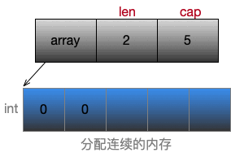

# slice、Array

### 描述一下slice

slice由array指针、len、cap组成结构，并且根据cap容量分配底层数组，初始化make的时候，根据元素大小和容量cap，计算所需的内存空间，如果所需大小小于32k则分配到gmp中p调度去的栈上，大于分配到堆上。预估扩容中，如果cap翻倍还是不够新的cap，那就是用newcap来扩容。 扩容长度小于1024的时候，按照cap翻倍，大于按照1/4增加，但这些都是相对的(内存对齐的考虑)。切片中的拷贝，取决于较短的切片 补充：另外我们可以通过reflect.SliceHeader来获取slice底层数据。  内存大小=预估容量(cap)*元素类型大小、内存对齐等。




### 空切片和nil切片的区别

1. nil切片和空切片指向的地址不一样。nil空切片引用数组指针地址为0

2. 空切片的引用数组指针地址是有的，且固定为一个值

3. 函数发生异常时候，通常返回nil切片，数据库集合等查询为空返回空切片

## 常常犯的坑

1 经常会append的数据的时候，修改了之前的数据，记住底层array是指针就可以了。go语言中的引用类型包含: 数组切片、字典(map)、通道（channel）、接口（interface）

2 切片中len长度和cap长度不同，不能越界访问，如len=2，index访问到3的数据。

3 slice [开始位置 : 结束位置]访问, index结束位置，可能和之前的数组等访问理解上有所差别

```
从数组生成切片，代码如下：
var a  = [3]int{1, 2, 3}
fmt.Println(a, a[1:2])
其中 a 是一个拥有 3 个整型元素的数组，被初始化为数值 1 到 3，使用 a[1:2] 可以生成一个新的切片，代码运行结果如下：
[1 2 3]  [2]

其中 [2] 就是 a[1:2] 切片操作的结果。
```


### 	切片与函数参数“陷阱”

- 记住函数参数和输入的时候，是两个不同的切片，可以打印输入和传入的参数地址，只是他们所指向的底层数组地址是相同的，所以在函数内部修改变量，其实是修改底层的数组。

### Array

数组是需要制定大小，并且是值传递，初始化后，无法修改长度

