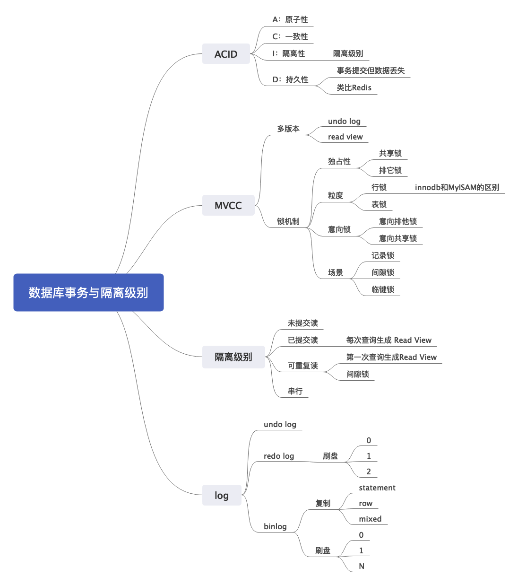

# 数据库事务

事务是指多个数据库操作组成一个逻辑执行单元，满足 ACID 四个条件。

A是指原子性，即这些操作要么全部成功，要么全部不成功，不存在中间状态。原子性是通过 undo log（回滚日志） 来保证的；
C是指一致性，数据库从一个状态转移到另外一个状态，数据完整性约束不变。在分布式语境下，这个很多时候是指数据如果存储了多份，那么每一份都应该是一样的。（后面分布式语境，要小心一点，因为这一步，可能会让面试官准备考察分布式事务）一致性则是通过持久性+原子性+隔离性来保证；
I是指隔离性，一个事务的执行不会影响另外一个事务；隔离性是通过 MVCC（多版本并发控制） 或锁机制来保证的；
D是指持久性，已提交对数据库的修改，应该永久保留在数据库中。持久性是通过 redo log （重做日志）来保证的；

在MySQL上，innodb引擎支持事务，但是MyISAM不支持事务。（这个是为了引导面试官问两个引擎的区别）

  1. 事务支持：InnoDB支持事务处理和外键（ForeignKey）约束。MyISAM则不支持事务处理和外键，只有表级别的锁定。
   2. 并发性：InnoDB具有行级锁定能力，可以为多个用户提供并发读写支持，提高了并发访问性能。而MyISAM则是表级锁定，只能串行处理，不支持高并发。
   3. 自动增长列（Auto Increment）：对于表中的自动增长列，MyISAM引擎会在表-level锁定整张表，阻止并发写入操作，而InnoDB则会利用自己的高精度锁定机制，仅仅锁住自动递增列，不会阻塞其他行的插入操作。
   4. 存储空间：MyISAM的存储结构简单，被优化过，因此大小比InnoDB小，查询速度和插入速度较快；而InnoDB则需要更多的存储空间，因为它要为每个表维护一个唯一的索引，而且还会在内存中建立额外的数据和索引缓存。
   5. 崩溃恢复：InnoDB支持崩溃恢复（Crash Recovery），可以在MySQL崩溃后自动恢复数据。而MyISAM则需要手动执行修复操作。

  总结：InnoDB对事务处理、外键支持和并发性的支持更好，而MyISAM则在性能方面较优，查询速度较快。因此，在选择使用哪种存储引擎时，需要根据具体应用场景进行权衡和选择。

### 并行事务会引发什么问题？

分析：MySQL 服务端是允许多个客户端连接的，这意味着 MySQL 会出现同时处理多个事务的情况。

答案：**在同时处理多个事务的时候，就可能出现脏读（dirty read）、不可重复读（non-repeatable read）、幻读（phantom read）的问题**。三个是如何发生的

- 脏读：指一个线程中的事务读取到了另外一个线程中未提交的数据。
- 不可重复读（虚读）：指一个线程中的事务读取到了另外一个线程中提交的update的数据。
- 幻读：指一个线程中的事务读取到了另外一个线程中提交的insert的数据。

更加巧妙的记法：

- 脏读：读到其他事务未提交的数据；
- 不可重复读：前后读取的数据不一致；
- 幻读：前后读取的**记录数量**不一致。

之后面试官肯定会接着问事务的隔离级别有哪些和区别

### 能够解释一下MySQL的隔离级别吗？

分析：考察基本的知识点。如果只是背出来各种隔离级别和对应存在的问题，那么就达标了。刷亮点如何刷呢？一个是结合 MVCC 来阐述MySQL是如何支持的；一个是讨论可重复读中，幻读是如何解决的。前者比较中规中矩，后者比较多是秀知识面。我们分成这两个思路，前面都类似，就是总结各种隔离级别。

数据库的隔离级别有四种：

1. 读未提交：事务可以读取另外一个事务没有提交的数据。            问题：脏读，不可重复读，幻读
2. 读提交：事务只能读取到另外一个已经提交的事务数据。            问题：     不可重复度，幻读
3. 可重复读：事务执行过程查询结果都是一致的，innodb 默认级别。     问题：               幻读
4. 串行化：读写都会相互阻塞                                   问题：

四种隔离级别具体是如何实现的呢：

- 对于「读未提交」隔离级别的事务来说，因为可以读到未提交事务修改的数据，所以直接读取最新的数据就好了；

- 对于「串行化」隔离级别的事务来说，通过加读写锁的方式来避免并行访问；

- 对于「读提交」和「可重复读」隔离级别的事务来说，它们是通过 `Read View `来实现的，它们的区别在于创建 `Read View` 的时机不同。

  「读提交」隔离级别是在「每个语句执行前」都会重新生成一个 `Read View`，

  「可重复读」隔离级别是「启动事务时」生成一个 `Read View`，然后整个事务期间都在用这个 `Read View`。

**一般的可重复读，无法解决幻读的问题，MySQL InnoDB 引擎的默认隔离级别虽然是「可重复读」。但是它很大程度上避免幻读现象（并不是完全解决了）**，解决的方案有两种：

- 针对**快照读**（普通 select 语句），是**通过 MVCC 方式解决了幻读**，因为可重复读隔离级别下，事务执行过程中看到的数据，一直跟这个事务启动时看到的数据是一致的，即使中途有其他事务插入了一条数据，是查询不出来这条数据的，所以就很好了避免幻读问题。
- 针对**当前读**（**`select ... for update（共享锁，也叫S锁）;SELECT ... LOCK IN SHARE MODE;UPDATE; INSERT; DELETE（排他锁，也叫X锁）`** 等语句），是**通过 next-key lock（记录锁+间隙锁）方式解决了幻读**，因为当执行 select ... for update 语句的时候，会加上 next-key lock，如果有其他事务在 next-key lock 锁范围内插入了一条记录，那么这个插入语句就会被阻塞，无法成功插入，所以就很好了避免幻读问题。

### MySQL 可重复读隔离级别，完全解决幻读了吗？

第一个例子：对于快照读， MVCC 并不能完全避免幻读现象。因为当事务 B插入数据， 事务A更新了刚才事务B插入的这条数据，那么事务 A 就可以查到这个条数据，前后两次查询的记录条目就不一样了，所以就发生幻读。

第二个例子：

- T1 时刻：事务 A 先执行「快照读语句」：select * from t_test where id > 100 得到了 3 条记录。
- T2 时刻：事务 B 往插入一个 id= 200 的记录并提交；
- T3 时刻：事务 A 再执行「当前读语句」 select * from t_test where id > 100 for update 就会得到 4 条记录，此时也发生了幻读现象。

**MVCC 方向：**
innodb 引擎利用了 `Read View` 来支持我们**读提交**和**可重复读**。`Read View`里面维护这四个变量：

1. up_limit_id：已提交事务ID + 1
2. low_limit_id：最大事务ID + 1
3. txn_ids：当前执行的事务ID
4. roll_pointer：隐藏列指针，指向每一个旧版本记录

提交读这个级别，默认读取是不加锁的，只有修改才会加锁。简单来说，已提交读，是每次查询都生成一个新的`Read View`，所以永远都能看到已经提交的事务。

可重复读则是在第一次查询生成`Read View`之后，后面的查询都是使用这个`Read View`。隐藏列指针可以获取到版本链的undo log的信息，所以可以获取到最开始的版本数据。

详细[Read View](https://blog.csdn.net/qq_42651904/article/details/110622818)细节可以查看

#### 如何引导

1. 前面聊到了MVCC提到隔离级别，机会合适就可以主动发起进攻

### 什么是 MVCC

分析：MVCC算是一个常考的点，而且是一个能考察得很细很深入的点，这里我们尽量将话题控制在一个难度适中的地步。当然，如果你是DBA，那么你应该一路往下探讨直到源码层。这个问题问得非常的大，所以我们只需要回答要点就可以。而后，面试官如果想继续了解你的水平，他就会根据他感兴趣的要点问下去。这里的难点就是，要点太多……要背很多。

答案：MVCC，多版本并发控制。`innodb`引擎主要是通过`undo log` 和事务版本号来实现多版本，利用锁机制来实现并发控制。

（接下来仔细解释`undo log`和版本号的运作机制，其中`undo log`是为了引导面试官继续问相关的问题，如`redo log`，`bin log`。）

`innodb`引擎会给每张表加一个隐含的列，存储的是事务版本号。当修改数据的时候，会生成一条对应的`undo log`，`undo log`一般用于事务回滚，里面含有版本信息。简单来说可以认为`undo log`存储了历史版本数据。每当发起查询的时候，`MySQL` 依据隔离级别的设置生成`Read View`，来判断当前查询可以读取哪个版本的数据。
这里注意MVCC只生效于RC和RR隔离级别。

- RC级别下：使用排它锁，读取数据不加锁而是使用了MVCC机制。这里就是为什么会造成不可重复读？因为该级别下，每次select都会生成一个版本号，读的都是不同的副本
- RR级别下：使用读写锁，以及MVCC。为什么能可重复度？因为多次读取只生成一个版本，读到的自然是相同数据。

而锁机制，对于 innodb 来说，有多个维度：
1. 从独占性来说，有排他锁和共享锁；
2. 从锁粒度来说，有行锁和表锁；
3. 从意向来说，有排他意向锁和共享意向锁；
4. 从场景来说，还可以分为记录锁，间隙锁和临键锁；

分析：到这里停下来，上面这一番回答，基本上什么都点到了，接下来就是等提问了。这一堆回答，涉及到了很多知识点，可以考察的非常多：
1. `undo log`, `redo log`, `binlog`
2. 隔离级别
3. 各种锁，其中又以记录锁、间隙锁和临键锁比较有亮点
4. Read View

关键点：多版本 = undo log + 事务版本号，并发控制=各种锁

#### 如何引导
1. 讨论数据库事务隔离级别

### 为什么需要MVCC，解决了哪些问题。

**1. 读写之间阻塞的问题**

通过 MVCC 可以让读写互相不阻塞，即读不阻塞写，写不阻塞读，这样就可以提升事务并发处理能力。

> 提高并发的演进思路：

- 普通锁，只能串行执行；
- 读写锁，可以实现读读并发；
- 数据多版本并发控制，可以实现读写并发。

 **2. 降低了死锁的概率**

因为 InnoDB 的 MVCC 采用了乐观锁的方式，读取数据时并不需要加锁，对于写操作，也只锁定必要的行。

**3. 解决一致性读的问题**

一致性读也被称为**快照读**，当我们查询数据库在某个时间点的快照时，只能看到这个时间点之前事务提交更新的结果，而不能看到这个时间点之后事务提交的更新结果。

### 什么是共享锁，排它锁

分析：概念题，答完顺便回答意向排他锁，意向共享锁，刷一波

答案：共享锁指别的事务可以读，但是不可以写。排他锁，是指别的事务既不可以读也不可以写。与之非常类似的是，意向共享锁和意向排他锁，事务在获取共享锁或者排他锁之前，要先获得对应的意向锁。意向锁是数据库自己加的，不需要干预。

（下面这段可能比较绕，记不住就算）
排它锁和其它三种都互斥；（X排斥一切）
意向排它锁和意向锁兼容；（IX 兼容 I）
共享锁和共享锁、意向共享锁兼容；（S 兼容 S）

### 什么是记录锁，临键锁，间隙锁

分析：概念题，可以点出来记录锁和行锁的关系，并且指明一下行锁是在索引项上加的。

答案：
1. 记录锁：锁住一行，所以叫做记录锁，也是行锁；
2. 间隙锁：锁住记录之间的间隔，或者索引之前的范围，或者所以之后的范围。只在重复读级别产生，（可以在前面隔离级别的地方提）
3. 临键锁（Next key lock）:记录锁和间隙锁的组合，即锁住记录，又锁住了间隙

### 为什么事务提交了但是数据没有保存

分析：这个问题呢，因为它和ACID的特性有冲突，所以是一个装逼点。一般不做 DBA，没踩过这一类的坑的人，比较容易忽略这一点。在前面提到 ACID 的 D 的时候，如果你记得这个，就可以主动说。整体来说，这是一个稍微高级一点的话题，所以要把握尺度，对这方面了解比较深刻，就一定要刷一波；如果感觉对面的面试官了解不深，也可以刷一波。

答案：在MySQL的innodb引擎中，事务提交后，必须将数据刷盘到磁盘上，如果在事务提交之后，没来得及刷到磁盘，就会出现事务已经提交，但是数据丢失了。（回到这一步你要开始判断，如果你是主动聊的，那就停下来，等面试官追问；如果这是面试官问的，那就接着答细节）MySQL的innodb引擎，事务提交的关键是将`redo log`写入到`Log buffer`，而后MySQL调用`write`写入到`OS cache`，只有到最后操作系统调用`fsync`的时候，才会落到磁盘上。

（为了方便记忆，记住这个过程：`commit` -> `log buffer` -> `OS cache` -> `fsync`）
（下面这一段是可选）
数据库有一个参数 `innodb_flush_log_at_trx_commit` 可以控制刷盘的时机：
1. 0，写到`log buffer`, 每秒刷新；
2. 1，实时刷新；
3. 2，写到`OS cache`, 每秒刷新

（接下来步入终极装逼环节，为了表达我们对这个问题的深刻理解，对OS的一般理解，我们得扩充一下回答面，慎用）

Redis的`AOF`机制也面临类似的问题，即`AOF`也不是立刻刷盘，而是写入到了`OS cache`，等到缓冲区填满，或者`Redis`决定刷盘才会刷到磁盘。而`redis`有三种策略控制，`always` 永远, `everysec` 每秒, `no` 不主动。默认情况下`everysec`，即有一秒钟的数据可能丢失。

（最后升华一下主题）
对于大多数要和磁盘打交道的系统来说，都会面临类似的问题，要么选择性能，要么选择强持久性。

关键字：提交不等于落盘了，`fsync`

#### 如何引导
1. 从`Redis` AOF 引过来，两边讨论的都是同一个主题；
2. 回答`ACID`的时候引导过来；
3. 讨论磁盘 IO 的时候看情况；
4. 讨论操作系统文件系统的时候，看情况；

核心就是，涉及到了`OS cache`，`fsync`等点，就可以引导来这边。

### 什么是redo log, undo log 和 binlog

分析：概念题。最好的回答是用`undo`, `redo`, `binlog`来讲述清楚事务与回滚，主从同步复制。这里我们做一个简要的回答，把精髓答出来。

答案：
1. `redo log` 是`innodb`引擎产生的，主要用于支持MySQL事务，MySQL会先写`redo log`，而后在写`binlog`。`redo log`可以保证即使数据库异常重启，数据也不会丢失
2. `undo log` 是`innodb`引擎产生的，主要时候用于解决事务回滚和MVCC。数据修改的时候，不仅记录`redo log`，也会记录`undo log`。在事务执行失败的时候，会使用`undo log`进行回滚；MVCC中read view也是通过`undo log`中记录的DB_TRX_ID和DB_ROLL_PTR回滚指针来查找历史的快照读等。
3. `binlog` 主要用于主从同步和数据恢复，记录了写入性的操作。`binlog`的格式也有三种：`STATEMENT`、`ROW`、`MIXED`。
- STATEMENT基于SQL语句的复制， 记录每一条修改的sql语句。优点是binlog日志少，缺点是有些sql重放会有问题，如delete from t where a>=4 and t_modified<='2018-11-10' limit 1;主库可能删除的是a，备库可能删除的是t_modified这个索引
- ROW基于行的复制， 优点是不出现语句执行不了， 如存储过程、或function、或trigger的调用。缺点是会产生大量的日志，尤其是alter table的时候会让日志暴涨
- MIEXD混合模式复制。可以将redis的持久化结合起来理解

（扩展点1，阐述两阶段提交）
因为`redo log`生成到`binlog`写入之间有一个时间差，所以为了保证两者的一致性，MySQL引入了两阶段提交:
1. 将数据写入buffer pool中
1. 将之前旧的数据写入到undolog中，便于回滚使用
1. 更新内存中的数据
1. Prepare阶段，写入`redo log`，标记为prepare状态；
2. Commit阶段，写入`binlog`，提交事务；

>  如果没有开启binlog,也不需要两阶段提交。只用一个redolog就够了。无论你的数据库如何crash，redolog中记录的内容总能让你MySQL内存中的数据恢复成crash之前的状态。
>
> 两阶段提交的主要用意是：为了保证redolog和binlog数据的安全一致性。只有在这两个日志文件逻辑上高度一致了。你才能放心地使用redolog帮你将数据库中的状态恢复成crash之前的状态，使用binlog实现数据备份、恢复、以及主从复制。而两阶段提交的机制可以保证这两个日志文件的逻辑是高度一致的。没有错误、没有冲突。

（扩展点2，阐述一下的刷盘时机）
1. `binlog` 刷盘可以通过`sync_binlog`参数来控制。0-系统自由判断，1-commit刷盘，N-每N个事务刷盘
2. `redo log`刷盘可以通过参数`innodb_flush_log_at_trx_commit`控制。0-写入`log buffer`，每秒刷新到盘；1-每次提交；2-写入到`OS cache`，每秒刷盘；
2. 一般情况下，都会讲binlog和redolog都设置为1保证数据不丢失，mysql默认值也是1

 (扩展点3，WAL和脏页等是什么)
1.  MySQL的WAL（Write-Ahead Logging）技术，先写日志，再写磁盘
2.  MySQL 从 内存更新到磁盘的过程，称为刷脏页的过程

> 刷脏页时机
>
> - redo log写满时，没有看见了，此时需要将checkpoint向前推进，推进的这部分日志对应的脏页刷入到磁盘，此时所有的更新全部阻塞，此时写的性能变为0，必须待刷一部分脏页后才能更新。
> - 系统内存不足时，需要将一部分数据页淘汰掉，如果淘汰的是脏页，需要先将脏页同步到磁盘。
> - MySQL认为空闲的时间，这种没有性能问题。
> - mysql正常关闭之前，会把所有脏页刷入磁盘，不存在性能问题。

(扩展点4，changebuf是什么)

唯一索引无法使用ChangeBuffer，由于唯一索引需要进行唯一性校验，所以对唯一索引进行更新时必须将对应的数据页加载到缓存中进行校验，从而导致ChangeBuffer失效。非唯一索引对索引的修改会引起大量的磁盘IO，影响数据库性能。如果不需要对数据库中某个字段做唯一性检查，最好使用普通索引。因为InnoDB引擎是以页为单位读取数据的，读取一条数据时，往往会将临近的数据也读到内存，所以多向后查询几条数据带来的性能差别微乎其微

### update操作究竟做了什么
a、执行器查找指定记录，如果记录所在的数据页在内存中，就直接返回给执行器；否则，需要先从磁盘读入内存，然后再返回。

b、执行器拿到Innodb存储引擎接口给的数据，执行update操作，得到新的数据，然后调用Innodb存储引擎的接口写入数据。

c、innodb存储引擎将这行新数据更新到内存中，同时将这个更新操作记录到redo log里面，此时redo log处于prepare状态。然后告知执行器执行完成了，随时可以提交事务。

d、执行器生成update操作的binlog，并把binlog写入磁盘。

e、执行器调用引擎的提交事务接口，引擎把刚刚写入的redo log改成提交（commit）状态，更新完成。

核心: 这里涉及到了上面阐述的两阶段的提交过程

1）集群正常运行的前提下：要有完整的binlog来保证从库的数据一致性。要有commit状态的redo log来保证主库的数据一致性 
2）发生crash的情况下：有prepare状态的redo log和完整的binlog也能保证主从库的数据一致性

### select语句的执行过程

答：
mysql可以分为server层和存储引擎层，客户端和服务器发起连接，mysql连接器管理链接、密码等，校验成功后，分析器会去解析`sql`, 之后优化器决定使用哪个索引，最后执行器操作引擎，获取存储引擎的数据，返回结果

## Reference
[一文理解MySQL MVCC](https://zhuanlan.zhihu.com/p/29150809)
[innodb中的事务隔离级别和锁的关系](https://tech.meituan.com/2014/08/20/innodb-lock.html)
[MySQL Update语句是怎么执行的](https://cloud.tencent.com/developer/article/1624168)
[从ReadView深入理解MySql MVCC原理](https://blog.csdn.net/qq_42651904/article/details/110622818)

